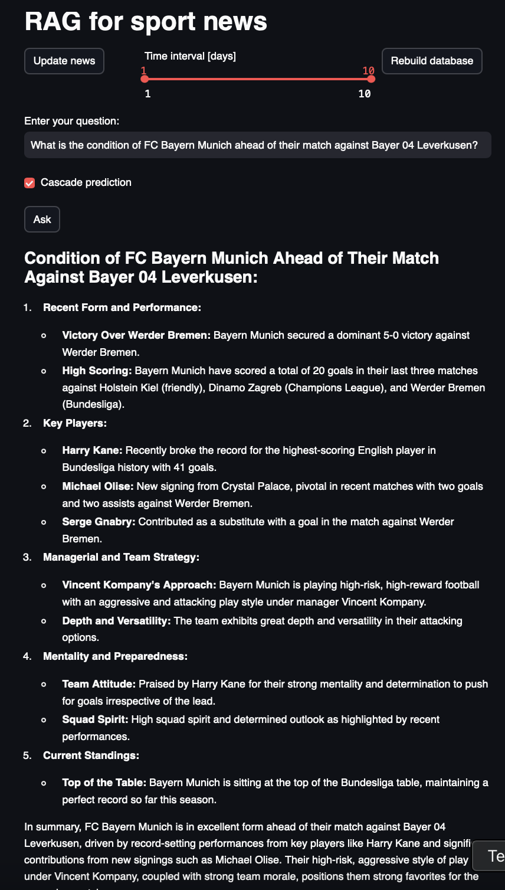
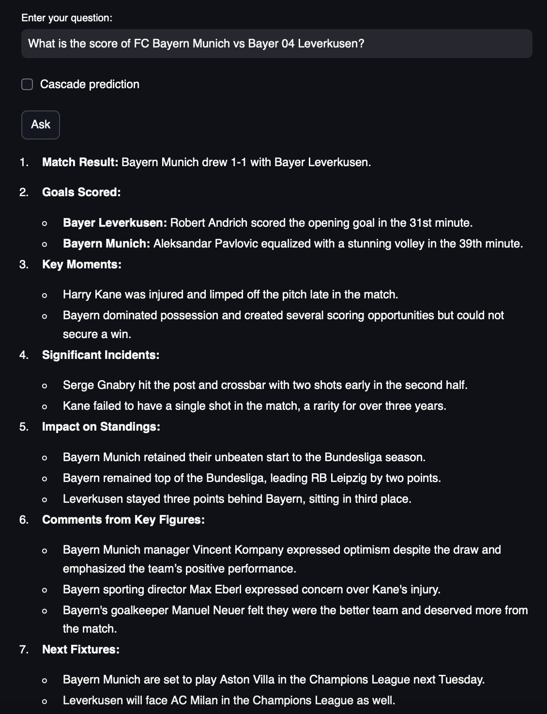

# LLM-zoomcamp project 

[LLM-zoomcamp](https://github.com/DataTalksClub/llm-zoomcamp)

This is an example of using a RAG (Retrieval-Augmented Generation) system to obtain concise, relevant information about sports events. Nowadays, many people don’t have the time to read all sports articles to stay updated on a particular team, league, or event. The idea here is to parse RSS feeds from the most popular online sports magazines, extract articles (from free-access websites), and use them to build context for LLMs (like ChatGPT).

Here is an example of a Streamlit app. You can specify a time interval for when the articles were published. The example below was generated on 28/09/2024, before the match between FC Bayern Munich and Bayer 04 Leverkusen.



Another example after the match  FC Bayern Munich and Bayer 04 Leverkusen.



Hallucination is the main challenge when using LLMs in practice, as the answers may not always be 100% accurate.

The main project is located in `rag_for_sport_news` directory. To run
```
cd rag_for_sport_news
pip install -r requirements.txt
streamlit run app.py
```

#### TODO
1. Integrate Elasticsearch (a vector database) to query the most relevant articles for a given question.
2. Add automatic RSS parsing several times per day.
